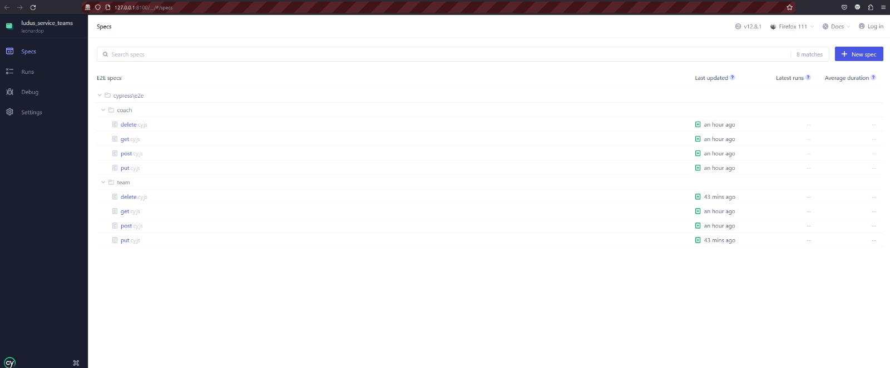

## ludus_service_teams
Microserviço do projeto de aplicativo de futebol para prover os recursos de dados dos times existentes em um campeonato.

## Requisitos
- Node
- cypress 
- cypress-plugin-api

## Como instalar?
1. Clone esse projeto via SSH (`git clone git@github.com:Professor-Dudarts/ludus_service_teams.git`)
2. Execute `npm install`
3. Rode o comando `npx cypress open` para ver a interface.

**Nota:** Precisa ter no Computador a API do docker feito pela equipe rodando para os testes ocorrem sem problemas.
**Nota:** o servidor `MySQL` está utilizando a porta **9906** e o servidor `PHP` a porta **8100** do seu computador, certifique-se que essas portas não estão sendo usadas

## Como utilizar o Cypess?

**Nota:** Apenas Click em algum dos testes apresentados na sua tela que irá funcionar.